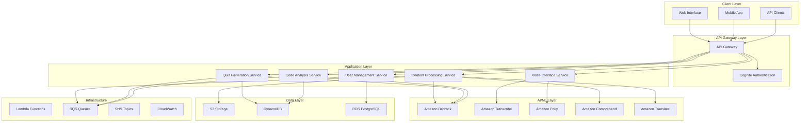

# Design Document: AI Learning Assistant

## Overview

The AI Learning Assistant is a cloud-native application built on AWS that provides intelligent content processing, interactive learning tools, and multilingual support for students and developers. The system leverages AWS AI/ML services including Amazon Bedrock for generative AI, Amazon Transcribe for speech-to-text, Amazon Polly for text-to-speech, and Amazon Comprehend for natural language processing.

The architecture follows a microservices pattern with event-driven communication, ensuring scalability, maintainability, and fault tolerance. The system processes various content types (text, video, audio, PDFs) and generates personalized learning materials including summaries, flashcards, quizzes, and code explanations.

## Architecture

The system follows a serverless, event-driven architecture using AWS services:



## Components and Interfaces

### Content Processing Service

**Responsibilities:**
- Process uploaded content (text, PDF, video, audio)
- Generate structured summaries using Amazon Bedrock
- Extract key concepts and create hierarchical content organization
- Handle multilingual content processing

**Key Interfaces:**
```typescript
interface ContentProcessor {
  processText(content: string, language: string): Promise<ProcessedContent>
  processVideo(videoUrl: string, language: string): Promise<ProcessedContent>
  processPDF(pdfUrl: string, language: string): Promise<ProcessedContent>
  generateSummary(content: string, summaryType: SummaryType): Promise<Summary>
}

interface ProcessedContent {
  id: string
  originalContent: string
  summary: Summary
  keyPoints: string[]
  concepts: Concept[]
  language: string
  processingTime: number
}
```

### Quiz Generation Service

**Responsibilities:**
- Generate flashcards from processed content
- Create various quiz types (multiple choice, true/false, fill-in-blank)
- Implement spaced repetition algorithms
- Track user progress and performance

**Key Interfaces:**
```typescript
interface QuizGenerator {
  generateFlashcards(contentId: string, count: number): Promise<Flashcard[]>
  generateQuiz(contentId: string, quizType: QuizType): Promise<Quiz>
  calculateSpacedRepetition(userId: string, cardId: string): Promise<RepetitionSchedule>
  recordQuizResult(userId: string, quizId: string, results: QuizResult): Promise<void>
}

interface Quiz {
  id: string
  contentId: string
  questions: Question[]
  timeLimit?: number
  passingScore: number
}
```

### Code Analysis Service

**Responsibilities:**
- Analyze code snippets in multiple programming languages
- Provide line-by-line explanations
- Suggest improvements and best practices
- Identify potential issues and anti-patterns

**Key Interfaces:**
```typescript
interface CodeAnalyzer {
  analyzeCode(code: string, language: ProgrammingLanguage): Promise<CodeAnalysis>
  explainCode(code: string, language: ProgrammingLanguage): Promise<CodeExplanation>
  suggestImprovements(code: string, language: ProgrammingLanguage): Promise<Improvement[]>
  detectIssues(code: string, language: ProgrammingLanguage): Promise<CodeIssue[]>
}

interface CodeAnalysis {
  explanation: string
  lineByLineAnalysis: LineAnalysis[]
  improvements: Improvement[]
  issues: CodeIssue[]
  complexity: ComplexityMetrics
}
```

### Voice Interface Service

**Responsibilities:**
- Convert speech to text using Amazon Transcribe
- Support multilingual voice input including Indian languages
- Generate audio responses using Amazon Polly
- Handle real-time voice interactions

**Key Interfaces:**
```typescript
interface VoiceInterface {
  transcribeAudio(audioData: Buffer, language: string): Promise<TranscriptionResult>
  synthesizeSpeech(text: string, language: string, voice: VoiceId): Promise<AudioBuffer>
  detectLanguage(audioData: Buffer): Promise<LanguageDetection>
  processVoiceCommand(audioData: Buffer): Promise<CommandResult>
}

interface TranscriptionResult {
  text: string
  confidence: number
  language: string
  timestamps: TimeStamp[]
}
```

### User Management Service

**Responsibilities:**
- Handle user authentication and authorization
- Manage user profiles and preferences
- Track learning progress and analytics
- Implement data privacy controls

**Key Interfaces:**
```typescript
interface UserManager {
  createUser(userData: UserRegistration): Promise<User>
  authenticateUser(credentials: LoginCredentials): Promise<AuthResult>
  updatePreferences(userId: string, preferences: UserPreferences): Promise<void>
  getProgress(userId: string): Promise<LearningProgress>
  deleteUserData(userId: string): Promise<void>
}

interface User {
  id: string
  email: string
  preferences: UserPreferences
  createdAt: Date
  lastActive: Date
}
```

## Data Models

### Core Entities

```typescript
// Content Management
interface Content {
  id: string
  userId: string
  title: string
  type: ContentType
  originalText: string
  processedSummary: string
  language: string
  uploadedAt: Date
  s3Location: string
  metadata: ContentMetadata
}

interface Summary {
  id: string
  contentId: string
  type: SummaryType
  text: string
  keyPoints: string[]
  hierarchicalStructure: SummaryNode[]
  generatedAt: Date
}

// Learning Tools
interface Flashcard {
  id: string
  contentId: string
  question: string
  answer: string
  difficulty: DifficultyLevel
  tags: string[]
  repetitionData: SpacedRepetitionData
}

interface Quiz {
  id: string
  contentId: string
  title: string
  questions: Question[]
  timeLimit: number
  passingScore: number
  createdAt: Date
}

interface Question {
  id: string
  type: QuestionType
  text: string
  options?: string[]
  correctAnswer: string
  explanation: string
  points: number
}

// Code Analysis
interface CodeSnippet {
  id: string
  userId: string
  code: string
  language: ProgrammingLanguage
  analysis: CodeAnalysis
  createdAt: Date
}

// User Progress
interface LearningSession {
  id: string
  userId: string
  contentId: string
  startTime: Date
  endTime: Date
  activitiesCompleted: Activity[]
  performanceMetrics: PerformanceMetrics
}

interface UserProgress {
  userId: string
  totalStudyTime: number
  contentProcessed: number
  quizzesCompleted: number
  averageScore: number
  streakDays: number
  achievements: Achievement[]
}
```

### Enums and Types

```typescript
enum ContentType {
  TEXT = 'text',
  PDF = 'pdf',
  VIDEO = 'video',
  AUDIO = 'audio',
  CODE = 'code'
}

enum SummaryType {
  BRIEF = 'brief',
  DETAILED = 'detailed',
  HIERARCHICAL = 'hierarchical',
  BULLET_POINTS = 'bullet_points'
}

enum QuestionType {
  MULTIPLE_CHOICE = 'multiple_choice',
  TRUE_FALSE = 'true_false',
  FILL_IN_BLANK = 'fill_in_blank',
  SHORT_ANSWER = 'short_answer'
}

enum ProgrammingLanguage {
  PYTHON = 'python',
  JAVASCRIPT = 'javascript',
  TYPESCRIPT = 'typescript',
  JAVA = 'java',
  CPP = 'cpp',
  CSHARP = 'csharp',
  GO = 'go',
  RUST = 'rust'
}

enum IndianLanguage {
  HINDI = 'hi',
  TAMIL = 'ta',
  TELUGU = 'te',
  BENGALI = 'bn',
  MARATHI = 'mr',
  GUJARATI = 'gu',
  KANNADA = 'kn',
  MALAYALAM = 'ml',
  PUNJABI = 'pa',
  ODIA = 'or'
}
```

## Correctness Properties

*A property is a characteristic or behavior that should hold true across all valid executions of a system—essentially, a formal statement about what the system should do. Properties serve as the bridge between human-readable specifications and machine-verifiable correctness guarantees.*

Based on the requirements analysis, the following properties ensure system correctness:

### Content Processing Properties

**Property 1: Content processing timing bounds**
*For any* valid content input (text, video, PDF), the system should complete processing within the specified time limits: 30 seconds for text/PDF content and 5 minutes for video content
**Validates: Requirements 1.1, 1.2, 8.1**

**Property 2: Technical term preservation**
*For any* content containing technical terms, processing and translation should preserve these terms in their original form while translating surrounding explanatory text
**Validates: Requirements 1.3, 4.3**

**Property 3: Hierarchical summary structure**
*For any* content exceeding 10,000 words, the generated summary should contain a hierarchical structure with main points and sub-points
**Validates: Requirements 1.4**

**Property 4: Error handling for unsupported formats**
*For any* unsupported file format, the system should return a descriptive error message and suggest supported formats
**Validates: Requirements 1.5**

### Learning Tools Properties

**Property 5: Quiz generation completeness**
*For any* processed content, flashcard generation should produce at least 10 question-answer pairs, and quiz generation should include multiple question types (multiple choice, true/false, fill-in-blank)
**Validates: Requirements 2.1, 2.4**

**Property 6: Quiz tracking and scoring**
*For any* completed quiz, the system should accurately track correct/incorrect answers, provide immediate feedback, and calculate percentage scores
**Validates: Requirements 2.2, 2.3**

**Property 7: Spaced repetition consistency**
*For any* flashcard review session, the scheduling should follow spaced repetition algorithms with increasing intervals for correctly answered cards
**Validates: Requirements 2.5**

### Code Analysis Properties

**Property 8: Code analysis completeness**
*For any* submitted code in supported programming languages, the analysis should provide line-by-line explanations, identify improvements, detect issues, and include relevant documentation links within 15 seconds
**Validates: Requirements 3.1, 3.2, 3.3, 3.4**

**Property 9: Complex algorithm breakdown**
*For any* complex algorithm code, the explanation should break down the logic into step-by-step explanations
**Validates: Requirements 3.5**

### Multilingual Support Properties

**Property 10: Language consistency**
*For any* input in Indian languages, the system should process and respond in the same language while maintaining context across language switches
**Validates: Requirements 4.1, 4.2**

**Property 11: Voice transcription accuracy**
*For any* voice input in Indian languages, transcription accuracy should be at least 90%
**Validates: Requirements 4.4**

**Property 12: Translation meaning preservation**
*For any* content translation between languages, the original meaning and technical accuracy should be maintained
**Validates: Requirements 4.5**

### Interface Properties

**Property 13: Voice interface round-trip**
*For any* voice input, the system should successfully convert speech to text, process the request, and provide audio responses in the user's preferred language
**Validates: Requirements 5.2, 5.3**

**Property 14: File upload functionality**
*For any* file upload operation, the system should support drag-and-drop functionality and display upload progress
**Validates: Requirements 5.4**

**Property 15: Result formatting consistency**
*For any* system output, results should be organized in scannable formats with proper headings and bullet points
**Validates: Requirements 5.5**

### Security and Infrastructure Properties

**Property 16: Data encryption compliance**
*For any* user content upload or storage operation, data should be encrypted in transit and at rest using AES-256 encryption
**Validates: Requirements 7.1**

**Property 17: Access control and audit logging**
*For any* user data access or modification, the system should enforce role-based access controls and maintain audit logs
**Validates: Requirements 7.2**

**Property 18: Data deletion completeness**
*For any* user data deletion request, all associated data should be permanently removed within 30 days
**Validates: Requirements 7.3**

**Property 19: Content usage consent**
*For any* user content processing, the content should not be used for training purposes without explicit user consent
**Validates: Requirements 7.4**

**Property 20: Authentication security**
*For any* user authentication attempt, the system should enforce multi-factor authentication and secure session management
**Validates: Requirements 7.5**

**Property 21: AWS service utilization**
*For any* AI/ML processing task, the system should utilize AWS Bedrock or SageMaker for model deployment and inference
**Validates: Requirements 6.3**

**Property 22: API management compliance**
*For any* API request, the system should implement rate limiting and load balancing through AWS API Gateway
**Validates: Requirements 6.4**

**Property 23: Storage security compliance**
*For any* content storage operation, the system should use AWS S3 with appropriate encryption and access controls
**Validates: Requirements 6.2**

### Error Handling Properties

**Property 24: Error logging and user messaging**
*For any* system error, detailed error information should be logged while providing user-friendly error messages to users
**Validates: Requirements 8.4**

## Error Handling

The system implements comprehensive error handling across all components:

### Content Processing Errors
- **Unsupported Format Errors**: Return descriptive messages with supported format suggestions
- **Processing Timeout Errors**: Implement graceful degradation with partial results when possible
- **Content Size Limit Errors**: Provide clear guidance on size limitations and chunking options
- **Language Detection Errors**: Fall back to English processing with user notification

### AI/ML Service Errors
- **Model Unavailability**: Implement fallback models and retry mechanisms
- **Rate Limiting**: Queue requests and provide estimated wait times
- **Inference Errors**: Log detailed error information and provide generic user messages
- **Token Limit Exceeded**: Implement content chunking and summarization strategies

### Voice Interface Errors
- **Transcription Failures**: Provide options to retry or switch to text input
- **Audio Quality Issues**: Implement noise reduction and quality enhancement
- **Language Mismatch**: Detect language mismatches and suggest corrections
- **Synthesis Errors**: Fall back to text responses when audio generation fails

### Data and Security Errors
- **Authentication Failures**: Implement secure lockout mechanisms and MFA recovery
- **Authorization Errors**: Provide clear access denied messages without exposing system details
- **Data Corruption**: Implement data integrity checks and recovery procedures
- **Encryption Failures**: Fail securely and prevent data exposure

### Infrastructure Errors
- **Service Unavailability**: Implement circuit breakers and graceful degradation
- **Network Timeouts**: Retry with exponential backoff and user notification
- **Storage Errors**: Implement redundancy and backup recovery mechanisms
- **Scaling Failures**: Monitor resource utilization and implement auto-scaling policies

## Testing Strategy

The system employs a comprehensive dual testing approach combining unit tests and property-based tests to ensure correctness and reliability.

### Property-Based Testing

Property-based tests validate universal properties across all inputs using a minimum of 100 iterations per test. Each property test references its corresponding design document property and validates the requirements it covers.

**Configuration Requirements:**
- **Testing Library**: Use Hypothesis for Python services, fast-check for TypeScript/JavaScript services
- **Iteration Count**: Minimum 100 iterations per property test
- **Test Tagging**: Each test tagged with format: **Feature: ai-learning-assistant, Property {number}: {property_text}**
- **Requirements Traceability**: Each property test must reference the specific requirements it validates

**Property Test Categories:**
1. **Content Processing Properties**: Test timing bounds, format handling, and output structure
2. **Learning Tools Properties**: Test quiz generation, scoring accuracy, and spaced repetition
3. **Code Analysis Properties**: Test explanation quality, improvement suggestions, and timing
4. **Multilingual Properties**: Test language consistency, translation accuracy, and voice processing
5. **Security Properties**: Test encryption, access controls, and data handling
6. **Interface Properties**: Test voice round-trips, file uploads, and result formatting

### Unit Testing

Unit tests complement property tests by focusing on specific examples, edge cases, and integration points:

**Unit Test Focus Areas:**
- **Specific Examples**: Test known good inputs and expected outputs
- **Edge Cases**: Test boundary conditions, empty inputs, and malformed data
- **Error Conditions**: Test specific error scenarios and recovery mechanisms
- **Integration Points**: Test service interactions and data flow between components
- **Mock Scenarios**: Test component behavior with mocked dependencies

**Testing Balance:**
- Property tests handle comprehensive input coverage through randomization
- Unit tests validate specific behaviors and catch concrete implementation bugs
- Integration tests verify end-to-end workflows and service interactions
- Both approaches are necessary for complete coverage and confidence

### Test Implementation Requirements

Each correctness property must be implemented as a single property-based test that:
1. Generates appropriate random inputs for the property domain
2. Executes the system functionality being tested
3. Validates the property assertion holds for all generated inputs
4. Reports failures with specific counterexamples
5. Includes proper test tagging for traceability

The testing strategy ensures that both universal correctness properties and specific implementation details are thoroughly validated, providing confidence in system reliability and correctness.