# Design Document: AI Learning Assistant

## Overview

The AI Learning Assistant is a comprehensive, production-ready cloud-native application built on AWS with **26 features** (16 implemented + 10 ready to deploy). The platform provides intelligent content processing, interactive learning tools, gamification, real-time collaboration, and multilingual support for students and developers across India.

The system leverages 15+ AWS AI/ML services including Amazon Bedrock (Claude 3.5 Sonnet) for generative AI, Amazon Transcribe for speech-to-text, Amazon Polly for text-to-speech, Amazon Translate for 22 Indian languages, Amazon Comprehend for NLP, Amazon Textract for OCR, and Amazon Rekognition for image understanding.

The architecture follows a microservices pattern with event-driven communication, ensuring scalability, maintainability, and fault tolerance. The system processes various content types (text, video, audio, PDFs, images, handwriting) and generates personalized learning materials including summaries, flashcards, quizzes, code explanations, and study paths.

**Key Innovations:**
- **AI Tutor with Socratic Method**: First-of-its-kind teaching AI that asks guiding questions
- **Interactive Code Playground**: Execute code in 10+ languages with AI assistance
- **Comprehensive Gamification**: 50+ achievements, 5 badge tiers, XP system with 100+ levels
- **Intelligent Study Paths**: ML-powered personalized learning paths with skill gap analysis
- **Multimodal AI**: Process text, voice, images, handwriting, diagrams, and code
- **Real-Time Collaboration**: Live quiz battles and study rooms with WebSocket
- **22 Indian Languages**: Full support including code-mixing (Hinglish, Tanglish)

## Architecture

The system follows a serverless, event-driven architecture using AWS services:

```mermaid
graph TB
    subgraph "Client Layer"
        WEB[Web Interface]
        MOBILE[Mobile App]
        API_CLIENT[API Clients]
    end
    
    subgraph "API Gateway Layer"
        APIGW[API Gateway]
        AUTH[Cognito Authentication]
    end
    
    subgraph "Application Layer"
        TUTOR[AI Tutor Service]
        PLAYGROUND[Code Playground Service]
        GAMIFICATION[Gamification Service]
        STUDYPATH[Study Path Generator]
        MULTIMODAL[Multimodal Processor]
        COLLAB[Collaboration Service]
        CONTENT[Content Processing Service]
        QUIZ[Quiz Generation Service]
        CODE[Code Analysis Service]
        VOICE[Voice Interface Service]
        USER[User Management Service]
    end
    
    subgraph "AI/ML Layer"
        BEDROCK[Amazon Bedrock - Claude 3.5]
        TRANSCRIBE[Amazon Transcribe]
        POLLY[Amazon Polly]
        COMPREHEND[Amazon Comprehend]
        TRANSLATE[Amazon Translate]
        TEXTRACT[Amazon Textract]
        REKOGNITION[Amazon Rekognition]
    end
    
    subgraph "Data Layer"
        S3[S3 Storage]
        DYNAMO[DynamoDB]
        RDS[RDS PostgreSQL]
    end
    
    subgraph "Infrastructure"
        LAMBDA[Lambda Functions]
        SQS[SQS Queues]
        SNS[SNS Topics]
        CLOUDWATCH[CloudWatch]
    end
    
    WEB --> APIGW
    MOBILE --> APIGW
    API_CLIENT --> APIGW
    APIGW --> AUTH
    APIGW --> TUTOR
    APIGW --> PLAYGROUND
    APIGW --> GAMIFICATION
    APIGW --> STUDYPATH
    APIGW --> MULTIMODAL
    APIGW --> COLLAB
    APIGW --> CONTENT
    APIGW --> QUIZ
    APIGW --> CODE
    APIGW --> VOICE
    APIGW --> USER
    
    TUTOR --> BEDROCK
    PLAYGROUND --> BEDROCK
    GAMIFICATION --> DYNAMO
    STUDYPATH --> BEDROCK
    MULTIMODAL --> BEDROCK
    MULTIMODAL --> TEXTRACT
    MULTIMODAL --> REKOGNITION
    COLLAB --> DYNAMO
    CONTENT --> BEDROCK
    CONTENT --> COMPREHEND
    CONTENT --> TRANSLATE
    QUIZ --> BEDROCK
    CODE --> BEDROCK
    VOICE --> TRANSCRIBE
    VOICE --> POLLY
    
    CONTENT --> S3
    QUIZ --> DYNAMO
    CODE --> DYNAMO
    USER --> RDS
    
    CONTENT --> SQS
    QUIZ --> SQS
    CODE --> SQS
```



## Components and Interfaces

### AI Tutor Service

**Responsibilities:**
- Provide conversational tutoring using Socratic method
- Maintain multi-turn dialogue context
- Adapt teaching style and difficulty
- Generate session summaries and progress reports
- Detect misconceptions and provide targeted guidance

**Key Interfaces:**
```typescript
interface AITutor {
  startSession(userId: string, subject: string, teachingStyle: TeachingStyle): Promise<TutorSession>
  askQuestion(sessionId: string, question: string, useSocraticMethod: boolean): Promise<TutorResponse>
  getSessionSummary(sessionId: string): Promise<SessionSummary>
  adaptDifficulty(sessionId: string, performanceData: PerformanceData): Promise<AdaptationResult>
}

interface TutorSession {
  sessionId: string
  userId: string
  subject: string
  teachingStyle: TeachingStyle
  messages: Message[]
  context: ConversationContext
  createdAt: Date
}

interface TutorResponse {
  answer: string
  followUpQuestions: string[]
  conceptsCovered: string[]
  difficultyAssessment: DifficultyLevel
  learningTips: string[]
}
```

### Code Playground Service

**Responsibilities:**
- Execute code in 10+ programming languages
- Provide AI-powered code completion
- Generate error explanations and fixes
- Create code visualizations
- Enable code sharing with unique URLs

**Key Interfaces:**
```typescript
interface CodePlayground {
  executeCode(code: string, language: ProgrammingLanguage, stdin?: string): Promise<ExecutionResult>
  getCodeCompletion(code: string, language: ProgrammingLanguage, cursorPosition: number): Promise<Completion[]>
  explainError(code: string, language: ProgrammingLanguage, errorMessage: string): Promise<ErrorExplanation>
  visualizeCode(code: string, language: ProgrammingLanguage): Promise<CodeVisualization>
  shareCode(code: string, language: ProgrammingLanguage, userId: string): Promise<ShareInfo>
}

interface ExecutionResult {
  success: boolean
  output: string
  error?: string
  executionTimeMs: number
  memoryUsedMb?: number
  exitCode: number
}
```

### Gamification Service

**Responsibilities:**
- Award XP and manage leveling system
- Track and unlock achievements
- Maintain leaderboards (global, friends, regional)
- Monitor daily/weekly streaks
- Award badge tiers

**Key Interfaces:**
```typescript
interface GamificationSystem {
  awardXP(userId: string, xpAmount: number, reason: string): Promise<XPAwardResult>
  updateStreak(userId: string): Promise<StreakInfo>
  getLeaderboard(type: LeaderboardType, period: TimePeriod, limit: number): Promise<Leaderboard>
  getUserAchievements(userId: string, includeLocked: boolean): Promise<Achievement[]>
  getUserStats(userId: string): Promise<UserStats>
}

interface UserStats {
  userId: string
  totalXP: number
  level: number
  currentStreak: number
  longestStreak: number
  achievementsUnlocked: number
  badges: Badge[]
}
```

### Study Path Generator Service

**Responsibilities:**
- Generate personalized learning paths
- Analyze skill gaps using ML
- Detect prerequisites automatically
- Adapt difficulty based on performance
- Predict time-to-mastery

**Key Interfaces:**
```typescript
interface StudyPathGenerator {
  generateStudyPath(userId: string, goal: string, currentLevel: string, durationWeeks: number): Promise<StudyPath>
  adaptDifficulty(pathId: string, performanceData: PerformanceData): Promise<AdaptationResult>
  predictCompletion(pathId: string, currentProgress: number, timeSpent: number): Promise<CompletionPrediction>
  analyzeSkillGaps(userId: string, goal: string): Promise<SkillGap[]>
}

interface StudyPath {
  pathId: string
  userId: string
  goal: string
  milestones: Milestone[]
  skillGaps: SkillGap[]
  totalHours: number
  progress: number
}
```

### Multimodal Processor Service

**Responsibilities:**
- Process handwritten notes with OCR
- Understand and explain diagrams
- Recognize and solve math equations
- Generate quizzes from screenshots
- Create visual flashcards

**Key Interfaces:**
```typescript
interface MultimodalProcessor {
  processHandwrittenNotes(imageData: Buffer, language: string): Promise<HandwritingResult>
  understandDiagram(imageData: Buffer, diagramType?: string): Promise<DiagramAnalysis>
  solveMathEquation(imageData: Buffer, showSteps: boolean): Promise<MathSolution>
  screenshotToQuiz(imageData: Buffer, questionCount: number): Promise<Quiz>
  createVisualFlashcards(imageData: Buffer, cardCount: number): Promise<Flashcard[]>
}

interface HandwritingResult {
  extractedText: string
  correctedText: string
  keyConcepts: string[]
  summary: string
  confidence: number
  flashcards: Flashcard[]
  quizQuestions: Question[]
}
```

### Collaboration Service

**Responsibilities:**
- Manage real-time study rooms
- Facilitate live quiz battles
- Synchronize progress across participants
- Handle WebSocket connections
- Broadcast messages and updates

**Key Interfaces:**
```typescript
interface CollaborationService {
  createRoom(creatorId: string, roomName: string, maxParticipants: number): Promise<StudyRoom>
  joinRoom(roomId: string, userId: string, username: string, connectionId: string): Promise<RoomInfo>
  startQuizBattle(roomId: string, quizId: string, questionCount: number): Promise<QuizBattle>
  submitBattleAnswer(battleId: string, userId: string, questionIndex: number, answer: string, isCorrect: boolean, timeTakenMs: number): Promise<BattleResult>
  syncProgress(roomId: string, userId: string, progressData: ProgressData): Promise<void>
}

interface StudyRoom {
  roomId: string
  name: string
  participants: Participant[]
  currentActivity?: string
  isActive: boolean
}
```

### Content Processing Service

**Responsibilities:**
- Process uploaded content (text, PDF, video, audio)
- Generate structured summaries using Amazon Bedrock
- Extract key concepts and create hierarchical content organization
- Handle multilingual content processing

**Key Interfaces:**
```typescript
interface ContentProcessor {
  processText(content: string, language: string): Promise<ProcessedContent>
  processVideo(videoUrl: string, language: string): Promise<ProcessedContent>
  processPDF(pdfUrl: string, language: string): Promise<ProcessedContent>
  generateSummary(content: string, summaryType: SummaryType): Promise<Summary>
}

interface ProcessedContent {
  id: string
  originalContent: string
  summary: Summary
  keyPoints: string[]
  concepts: Concept[]
  language: string
  processingTime: number
}
```

### Quiz Generation Service

**Responsibilities:**
- Generate flashcards from processed content
- Create various quiz types (multiple choice, true/false, fill-in-blank)
- Implement spaced repetition algorithms
- Track user progress and performance

**Key Interfaces:**
```typescript
interface QuizGenerator {
  generateFlashcards(contentId: string, count: number): Promise<Flashcard[]>
  generateQuiz(contentId: string, quizType: QuizType): Promise<Quiz>
  calculateSpacedRepetition(userId: string, cardId: string): Promise<RepetitionSchedule>
  recordQuizResult(userId: string, quizId: string, results: QuizResult): Promise<void>
}

interface Quiz {
  id: string
  contentId: string
  questions: Question[]
  timeLimit?: number
  passingScore: number
}
```

### Code Analysis Service

**Responsibilities:**
- Analyze code snippets in multiple programming languages
- Provide line-by-line explanations
- Suggest improvements and best practices
- Identify potential issues and anti-patterns

**Key Interfaces:**
```typescript
interface CodeAnalyzer {
  analyzeCode(code: string, language: ProgrammingLanguage): Promise<CodeAnalysis>
  explainCode(code: string, language: ProgrammingLanguage): Promise<CodeExplanation>
  suggestImprovements(code: string, language: ProgrammingLanguage): Promise<Improvement[]>
  detectIssues(code: string, language: ProgrammingLanguage): Promise<CodeIssue[]>
}

interface CodeAnalysis {
  explanation: string
  lineByLineAnalysis: LineAnalysis[]
  improvements: Improvement[]
  issues: CodeIssue[]
  complexity: ComplexityMetrics
}
```

### Voice Interface Service

**Responsibilities:**
- Convert speech to text using Amazon Transcribe
- Support multilingual voice input including Indian languages
- Generate audio responses using Amazon Polly
- Handle real-time voice interactions

**Key Interfaces:**
```typescript
interface VoiceInterface {
  transcribeAudio(audioData: Buffer, language: string): Promise<TranscriptionResult>
  synthesizeSpeech(text: string, language: string, voice: VoiceId): Promise<AudioBuffer>
  detectLanguage(audioData: Buffer): Promise<LanguageDetection>
  processVoiceCommand(audioData: Buffer): Promise<CommandResult>
}

interface TranscriptionResult {
  text: string
  confidence: number
  language: string
  timestamps: TimeStamp[]
}
```

### User Management Service

**Responsibilities:**
- Handle user authentication and authorization
- Manage user profiles and preferences
- Track learning progress and analytics
- Implement data privacy controls

**Key Interfaces:**
```typescript
interface UserManager {
  createUser(userData: UserRegistration): Promise<User>
  authenticateUser(credentials: LoginCredentials): Promise<AuthResult>
  updatePreferences(userId: string, preferences: UserPreferences): Promise<void>
  getProgress(userId: string): Promise<LearningProgress>
  deleteUserData(userId: string): Promise<void>
}

interface User {
  id: string
  email: string
  preferences: UserPreferences
  createdAt: Date
  lastActive: Date
}
```

## Data Models

### Core Entities

```typescript
// AI Tutor
interface TutorSession {
  sessionId: string
  userId: string
  subject: string
  teachingStyle: TeachingStyle
  messages: TutorMessage[]
  context: ConversationContext
  createdAt: Date
  updatedAt: Date
}

interface TutorMessage {
  role: 'user' | 'assistant'
  content: string
  timestamp: Date
  followUpQuestions?: string[]
  conceptsCovered?: string[]
}

// Gamification
interface UserStats {
  userId: string
  totalXP: number
  level: number
  currentStreak: number
  longestStreak: number
  quizzesCompleted: number
  perfectScores: number
  codeAnalyzed: number
  flashcardsReviewed: number
  studyTimeMinutes: number
  achievementsUnlocked: number
  badges: Badge[]
  lastActivity: Date
}

interface Achievement {
  achievementId: string
  name: string
  description: string
  type: AchievementType
  tier: BadgeTier
  xpReward: number
  icon: string
  criteria: AchievementCriteria
  unlocked: boolean
  unlockedAt?: Date
}

// Study Path
interface StudyPath {
  pathId: string
  userId: string
  goal: string
  currentLevel: string
  targetLevel: string
  durationWeeks: number
  totalHours: number
  milestones: Milestone[]
  skillGaps: SkillGap[]
  progress: number
  createdAt: Date
}

interface Milestone {
  milestoneId: string
  title: string
  description: string
  skills: string[]
  estimatedHours: number
  weekNumber: number
  resources: Resource[]
  assessments: string[]
}

interface SkillGap {
  skill: string
  currentLevel: number
  targetLevel: number
  gapSize: number
  priority: Priority
  estimatedHours: number
}

// Collaboration
interface StudyRoom {
  roomId: string
  name: string
  creatorId: string
  maxParticipants: number
  participants: Participant[]
  currentActivity?: string
  createdAt: Date
  isActive: boolean
}

interface QuizBattle {
  battleId: string
  roomId: string
  quizId: string
  participants: string[]
  scores: Record<string, number>
  currentQuestion: number
  totalQuestions: number
  startedAt: Date
  status: BattleStatus
}

// Code Playground
interface CodeExecution {
  executionId: string
  userId: string
  code: string
  language: ProgrammingLanguage
  result: ExecutionResult
  createdAt: Date
}

interface CodeShare {
  shareId: string
  userId: string
  code: string
  language: ProgrammingLanguage
  shareUrl: string
  expiresAt: Date
  createdAt: Date
}

// Multimodal
interface ProcessedImage {
  imageId: string
  userId: string
  imageType: ImageType
  extractedContent: string
  analysis: ImageAnalysis
  generatedContent: GeneratedContent
  processedAt: Date
}

// Content Management
interface Content {
  id: string
  userId: string
  title: string
  type: ContentType
  originalText: string
  processedSummary: string
  language: string
  uploadedAt: Date
  s3Location: string
  metadata: ContentMetadata
}

interface Summary {
  id: string
  contentId: string
  type: SummaryType
  text: string
  keyPoints: string[]
  hierarchicalStructure: SummaryNode[]
  generatedAt: Date
}

// Learning Tools
interface Flashcard {
  id: string
  contentId: string
  question: string
  answer: string
  difficulty: DifficultyLevel
  tags: string[]
  repetitionData: SpacedRepetitionData
}

interface Quiz {
  id: string
  contentId: string
  title: string
  questions: Question[]
  timeLimit: number
  passingScore: number
  createdAt: Date
}

interface Question {
  id: string
  type: QuestionType
  text: string
  options?: string[]
  correctAnswer: string
  explanation: string
  points: number
}

// Code Analysis
interface CodeSnippet {
  id: string
  userId: string
  code: string
  language: ProgrammingLanguage
  analysis: CodeAnalysis
  createdAt: Date
}

// User Progress
interface LearningSession {
  id: string
  userId: string
  contentId: string
  startTime: Date
  endTime: Date
  activitiesCompleted: Activity[]
  performanceMetrics: PerformanceMetrics
}

interface UserProgress {
  userId: string
  totalStudyTime: number
  contentProcessed: number
  quizzesCompleted: number
  averageScore: number
  streakDays: number
  achievements: Achievement[]
}
```

### Enums and Types

```typescript
enum TeachingStyle {
  SOCRATIC = 'socratic',
  DIRECT = 'direct',
  EXPLORATORY = 'exploratory'
}

enum AchievementType {
  STREAK = 'streak',
  QUIZ_MASTER = 'quiz_master',
  CODE_WARRIOR = 'code_warrior',
  KNOWLEDGE_SEEKER = 'knowledge_seeker',
  SOCIAL_LEARNER = 'social_learner',
  SPEED_DEMON = 'speed_demon',
  PERFECTIONIST = 'perfectionist',
  POLYGLOT = 'polyglot',
  EARLY_BIRD = 'early_bird',
  NIGHT_OWL = 'night_owl'
}

enum BadgeTier {
  BRONZE = 'bronze',
  SILVER = 'silver',
  GOLD = 'gold',
  PLATINUM = 'platinum',
  DIAMOND = 'diamond'
}

enum LeaderboardType {
  GLOBAL = 'global',
  FRIENDS = 'friends',
  REGIONAL = 'regional'
}

enum BattleStatus {
  WAITING = 'waiting',
  ACTIVE = 'active',
  COMPLETED = 'completed'
}

enum ImageType {
  HANDWRITING = 'handwriting',
  DIAGRAM = 'diagram',
  MATH_EQUATION = 'math_equation',
  SCREENSHOT = 'screenshot',
  CODE_SCREENSHOT = 'code_screenshot'
}

enum ContentType {
  TEXT = 'text',
  PDF = 'pdf',
  VIDEO = 'video',
  AUDIO = 'audio',
  CODE = 'code',
  IMAGE = 'image'
}

enum SummaryType {
  BRIEF = 'brief',
  DETAILED = 'detailed',
  HIERARCHICAL = 'hierarchical',
  BULLET_POINTS = 'bullet_points'
}

enum QuestionType {
  MULTIPLE_CHOICE = 'multiple_choice',
  TRUE_FALSE = 'true_false',
  FILL_IN_BLANK = 'fill_in_blank',
  SHORT_ANSWER = 'short_answer'
}

enum ProgrammingLanguage {
  PYTHON = 'python',
  JAVASCRIPT = 'javascript',
  TYPESCRIPT = 'typescript',
  JAVA = 'java',
  CPP = 'cpp',
  C = 'c',
  CSHARP = 'csharp',
  GO = 'go',
  RUST = 'rust',
  RUBY = 'ruby',
  PHP = 'php'
}

enum IndianLanguage {
  HINDI = 'hi',
  TAMIL = 'ta',
  TELUGU = 'te',
  BENGALI = 'bn',
  MARATHI = 'mr',
  GUJARATI = 'gu',
  KANNADA = 'kn',
  MALAYALAM = 'ml',
  PUNJABI = 'pa',
  ODIA = 'or',
  ASSAMESE = 'as',
  URDU = 'ur',
  SANSKRIT = 'sa',
  KASHMIRI = 'ks',
  SINDHI = 'sd',
  NEPALI = 'ne',
  KONKANI = 'kok',
  MANIPURI = 'mni',
  DOGRI = 'doi',
  SANTALI = 'sat',
  MAITHILI = 'mai',
  BODO = 'brx'
}
```

## Correctness Properties

*A property is a characteristic or behavior that should hold true across all valid executions of a system—essentially, a formal statement about what the system should do. Properties serve as the bridge between human-readable specifications and machine-verifiable correctness guarantees.*

Based on the requirements analysis, the following properties ensure system correctness:

### AI Tutor Properties

**Property 1: Socratic method teaching**
*For any* user question in a tutoring session, the AI tutor should respond with 2-3 guiding questions instead of direct answers when Socratic method is enabled
**Validates: Requirements 1.2**

**Property 2: Context retention**
*For any* multi-turn conversation in a tutoring session, the system should maintain full context of all previous exchanges
**Validates: Requirements 1.3**

**Property 3: Session summary generation**
*For any* completed tutoring session, the system should generate a summary with key learnings, areas for improvement, and progress assessment
**Validates: Requirements 1.4**

**Property 4: Adaptive difficulty**
*For any* tutoring session with user responses, the system should adapt difficulty level based on performance and detect misconceptions
**Validates: Requirements 1.5**

### Code Playground Properties

**Property 5: Multi-language execution**
*For any* valid code in supported languages (Python, JavaScript, Java, C++, Go, Rust, Ruby, PHP, TypeScript, C), the system should execute within 5 seconds
**Validates: Requirements 2.1, 2.4**

**Property 6: AI code completion**
*For any* code being written, the system should provide relevant AI-powered completion suggestions in real-time
**Validates: Requirements 2.2**

**Property 7: Error explanation quality**
*For any* code execution failure, the system should provide AI-generated error explanations with specific fix suggestions
**Validates: Requirements 2.3**

**Property 8: Code visualization**
*For any* submitted code, the system should generate flowcharts and call graphs when visualization is requested
**Validates: Requirements 2.5**

### Gamification Properties

**Property 9: XP award consistency**
*For any* completed activity, the system should award appropriate XP and update user level using exponential growth formula
**Validates: Requirements 3.1**

**Property 10: Achievement unlocking**
*For any* milestone reached, the system should check and unlock relevant achievements from 50+ available types
**Validates: Requirements 3.2**

**Property 11: Streak tracking**
*For any* daily user activity, the system should accurately track streaks and award streak-based achievements
**Validates: Requirements 3.3**

**Property 12: Leaderboard accuracy**
*For any* leaderboard query, the system should return accurate rankings for global, friends, and regional leaderboards
**Validates: Requirements 3.4**

**Property 13: Badge tier progression**
*For any* achievement unlock, the system should award appropriate badge tier (Bronze, Silver, Gold, Platinum, Diamond)
**Validates: Requirements 3.5**

### Study Path Properties

**Property 14: Skill gap analysis**
*For any* learning goal, the system should analyze skill gaps using ML algorithms and identify specific areas needing improvement
**Validates: Requirements 4.1**

**Property 15: Prerequisite detection**
*For any* study path generation, the system should automatically detect prerequisites and order milestones appropriately
**Validates: Requirements 4.2**

**Property 16: Performance-based adaptation**
*For any* user progress data, the system should adapt difficulty and adjust study path based on performance metrics
**Validates: Requirements 4.3**

**Property 17: Completion prediction accuracy**
*For any* active study path, the system should provide time-to-mastery estimates with confidence levels
**Validates: Requirements 4.4**

**Property 18: Resource personalization**
*For any* study path, the system should recommend resources based on user's learning style
**Validates: Requirements 4.5**

### Multimodal Processing Properties

**Property 19: Handwriting OCR accuracy**
*For any* uploaded handwritten notes, the system should perform OCR with at least 90% accuracy
**Validates: Requirements 5.1**

**Property 20: Diagram understanding**
*For any* uploaded diagram, the system should identify and explain components and their relationships
**Validates: Requirements 5.2**

**Property 21: Math equation solving**
*For any* uploaded math equation image, the system should recognize and solve with step-by-step solutions
**Validates: Requirements 5.3**

**Property 22: Screenshot quiz generation**
*For any* uploaded screenshot, the system should generate relevant quiz questions from the content
**Validates: Requirements 5.4**

**Property 23: Visual flashcard creation**
*For any* processed image, the system should automatically create visual flashcards
**Validates: Requirements 5.5**

### Collaboration Properties

**Property 24: Room capacity management**
*For any* study room, the system should support up to 50 participants with WebSocket connections
**Validates: Requirements 6.1**

**Property 25: Real-time synchronization**
*For any* quiz battle, the system should synchronize questions and track scores in real-time across all participants
**Validates: Requirements 6.2**

**Property 26: Instant leaderboard updates**
*For any* answer submission in a battle, the system should update leaderboards within 100ms with time-based scoring
**Validates: Requirements 6.3**

**Property 27: Message broadcasting**
*For any* chat message, the system should broadcast to all room participants within 100ms
**Validates: Requirements 6.4**

**Property 28: Progress synchronization**
*For any* learning progress update, the system should sync across all participants in real-time
**Validates: Requirements 6.5**

### Content Processing Properties

**Property 29: Content processing timing bounds**
*For any* valid content input (text, video, PDF), the system should complete processing within the specified time limits: 30 seconds for text/PDF content and 5 minutes for video content
**Validates: Requirements 7.1, 7.2, 14.1**

**Property 30: Technical term preservation**
*For any* content containing technical terms, processing and translation should preserve these terms in their original form while translating surrounding explanatory text
**Validates: Requirements 7.3, 10.3**

**Property 31: Hierarchical summary structure**
*For any* content exceeding 10,000 words, the generated summary should contain a hierarchical structure with main points and sub-points
**Validates: Requirements 7.4**

**Property 32: Error handling for unsupported formats**
*For any* unsupported file format, the system should return a descriptive error message and suggest supported formats
**Validates: Requirements 7.5**

### Learning Tools Properties

**Property 33: Quiz generation completeness**
*For any* processed content, flashcard generation should produce at least 10 question-answer pairs, and quiz generation should include multiple question types (multiple choice, true/false, fill-in-blank)
**Validates: Requirements 8.1, 8.4**

**Property 34: Quiz tracking and scoring**
*For any* completed quiz, the system should accurately track correct/incorrect answers, provide immediate feedback, and calculate percentage scores
**Validates: Requirements 8.2, 8.3**

**Property 35: Spaced repetition consistency**
*For any* flashcard review session, the scheduling should follow spaced repetition algorithms with increasing intervals for correctly answered cards
**Validates: Requirements 8.5**

### Code Analysis Properties

**Property 36: Code analysis completeness**
*For any* submitted code in supported programming languages, the analysis should provide line-by-line explanations, identify improvements, detect issues, and include relevant documentation links within 15 seconds
**Validates: Requirements 9.1, 9.2, 9.3, 9.4**

**Property 37: Complex algorithm breakdown**
*For any* complex algorithm code, the explanation should break down the logic into step-by-step explanations
**Validates: Requirements 9.5**

### Multilingual Support Properties

**Property 38: Language consistency and code-mixing**
*For any* input in 22 Indian languages or code-mixed languages (Hinglish, Tanglish), the system should process and respond appropriately while maintaining context
**Validates: Requirements 10.1, 10.2**

**Property 39: Cultural context preservation**
*For any* content translation, the system should preserve technical terms and maintain cultural context
**Validates: Requirements 10.3**

**Property 40: Voice transcription accuracy**
*For any* voice input in Indian languages, transcription accuracy should be at least 90%
**Validates: Requirements 10.4**

**Property 41: Indian script recognition**
*For any* handwritten content in Indian scripts (Devanagari, Tamil, Telugu, Bengali, etc.), the system should recognize and process accurately
**Validates: Requirements 10.5**

### Interface Properties

**Property 42: Voice interface round-trip**
*For any* voice input, the system should successfully convert speech to text, process the request, and provide audio responses in the user's preferred language
**Validates: Requirements 11.2, 11.3**

**Property 43: File upload functionality**
*For any* file upload operation, the system should support drag-and-drop functionality and display upload progress
**Validates: Requirements 11.4**

**Property 44: Result formatting consistency**
*For any* system output, results should be organized in scannable formats with proper headings and bullet points
**Validates: Requirements 11.5**

### Security and Infrastructure Properties

**Property 45: Data encryption compliance**
*For any* user content upload or storage operation, data should be encrypted in transit and at rest using AES-256 encryption
**Validates: Requirements 13.1**

**Property 46: Access control and audit logging**
*For any* user data access or modification, the system should enforce role-based access controls and maintain audit logs
**Validates: Requirements 13.2**

**Property 47: Data deletion completeness**
*For any* user data deletion request, all associated data should be permanently removed within 30 days
**Validates: Requirements 13.3**

**Property 48: Content usage consent**
*For any* user content processing, the content should not be used for training purposes without explicit user consent
**Validates: Requirements 13.4**

**Property 49: Authentication security**
*For any* user authentication attempt, the system should enforce multi-factor authentication and secure session management
**Validates: Requirements 13.5**

**Property 50: AWS service utilization**
*For any* AI/ML processing task, the system should utilize AWS Bedrock or SageMaker for model deployment and inference
**Validates: Requirements 12.3**

**Property 51: API management compliance**
*For any* API request, the system should implement rate limiting and load balancing through AWS API Gateway
**Validates: Requirements 12.4**

**Property 52: Storage security compliance**
*For any* content storage operation, the system should use AWS S3 with appropriate encryption and access controls
**Validates: Requirements 12.2**

### Error Handling Properties

**Property 53: Error logging and user messaging**
*For any* system error, detailed error information should be logged while providing user-friendly error messages to users
**Validates: Requirements 14.4**

## Error Handling

The system implements comprehensive error handling across all components:

### Content Processing Errors
- **Unsupported Format Errors**: Return descriptive messages with supported format suggestions
- **Processing Timeout Errors**: Implement graceful degradation with partial results when possible
- **Content Size Limit Errors**: Provide clear guidance on size limitations and chunking options
- **Language Detection Errors**: Fall back to English processing with user notification

### AI/ML Service Errors
- **Model Unavailability**: Implement fallback models and retry mechanisms
- **Rate Limiting**: Queue requests and provide estimated wait times
- **Inference Errors**: Log detailed error information and provide generic user messages
- **Token Limit Exceeded**: Implement content chunking and summarization strategies

### Voice Interface Errors
- **Transcription Failures**: Provide options to retry or switch to text input
- **Audio Quality Issues**: Implement noise reduction and quality enhancement
- **Language Mismatch**: Detect language mismatches and suggest corrections
- **Synthesis Errors**: Fall back to text responses when audio generation fails

### Data and Security Errors
- **Authentication Failures**: Implement secure lockout mechanisms and MFA recovery
- **Authorization Errors**: Provide clear access denied messages without exposing system details
- **Data Corruption**: Implement data integrity checks and recovery procedures
- **Encryption Failures**: Fail securely and prevent data exposure

### Infrastructure Errors
- **Service Unavailability**: Implement circuit breakers and graceful degradation
- **Network Timeouts**: Retry with exponential backoff and user notification
- **Storage Errors**: Implement redundancy and backup recovery mechanisms
- **Scaling Failures**: Monitor resource utilization and implement auto-scaling policies

## Testing Strategy

The system employs a comprehensive dual testing approach combining unit tests and property-based tests to ensure correctness and reliability.

### Property-Based Testing

Property-based tests validate universal properties across all inputs using a minimum of 100 iterations per test. Each property test references its corresponding design document property and validates the requirements it covers.

**Configuration Requirements:**
- **Testing Library**: Use Hypothesis for Python services, fast-check for TypeScript/JavaScript services
- **Iteration Count**: Minimum 100 iterations per property test
- **Test Tagging**: Each test tagged with format: **Feature: ai-learning-assistant, Property {number}: {property_text}**
- **Requirements Traceability**: Each property test must reference the specific requirements it validates

**Property Test Categories:**
1. **Content Processing Properties**: Test timing bounds, format handling, and output structure
2. **Learning Tools Properties**: Test quiz generation, scoring accuracy, and spaced repetition
3. **Code Analysis Properties**: Test explanation quality, improvement suggestions, and timing
4. **Multilingual Properties**: Test language consistency, translation accuracy, and voice processing
5. **Security Properties**: Test encryption, access controls, and data handling
6. **Interface Properties**: Test voice round-trips, file uploads, and result formatting

### Unit Testing

Unit tests complement property tests by focusing on specific examples, edge cases, and integration points:

**Unit Test Focus Areas:**
- **Specific Examples**: Test known good inputs and expected outputs
- **Edge Cases**: Test boundary conditions, empty inputs, and malformed data
- **Error Conditions**: Test specific error scenarios and recovery mechanisms
- **Integration Points**: Test service interactions and data flow between components
- **Mock Scenarios**: Test component behavior with mocked dependencies

**Testing Balance:**
- Property tests handle comprehensive input coverage through randomization
- Unit tests validate specific behaviors and catch concrete implementation bugs
- Integration tests verify end-to-end workflows and service interactions
- Both approaches are necessary for complete coverage and confidence

### Test Implementation Requirements

Each correctness property must be implemented as a single property-based test that:
1. Generates appropriate random inputs for the property domain
2. Executes the system functionality being tested
3. Validates the property assertion holds for all generated inputs
4. Reports failures with specific counterexamples
5. Includes proper test tagging for traceability

The testing strategy ensures that both universal correctness properties and specific implementation details are thoroughly validated, providing confidence in system reliability and correctness.