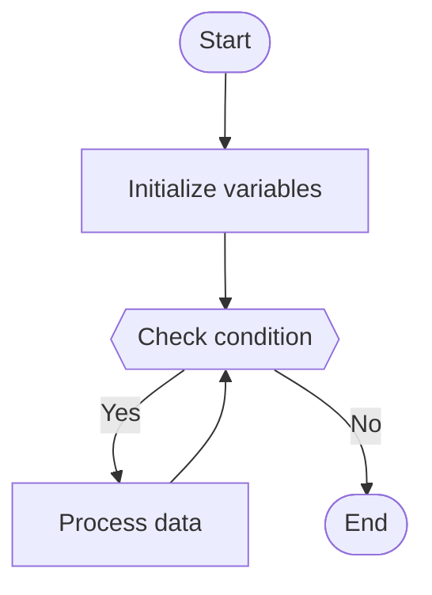

# Complex Algorithm Explanation Implementation

## Overview

This document describes the implementation of Task 8.4: Complex Algorithm Explanation functionality for the AI Learning Assistant. This feature provides comprehensive explanations of complex algorithms including step-by-step breakdowns, visual flow diagrams, complexity analysis, and optimization suggestions.

## Requirements

**Requirement 3.5**: When processing complex algorithms, the Code Analyzer shall break down the logic into step-by-step explanations.

## Features

The complex algorithm explanation functionality provides four key components:

### 1. Step-by-Step Algorithm Breakdown

Detailed breakdown of algorithm logic into numbered steps with:
- **Step Number**: Sequential numbering for easy reference
- **Title**: Brief description of what the step does
- **Description**: Detailed explanation of the step's purpose and operation
- **Code Snippet**: Relevant code fragment (when applicable)

### 2. Visual Flow Diagrams

Mermaid flowchart diagrams that visually represent algorithm flow:
- **Start/End Nodes**: Stadium-shaped nodes for entry/exit points
- **Process Nodes**: Rectangular nodes for operations
- **Decision Nodes**: Diamond-shaped nodes for conditionals
- **Flow Arrows**: Directional arrows showing execution path

### 3. Complexity Analysis

Comprehensive time and space complexity analysis including:
- **Time Complexity**: Big O notation for time requirements
- **Time Explanation**: Detailed reasoning for time complexity
- **Space Complexity**: Big O notation for memory usage
- **Space Explanation**: Detailed reasoning for space requirements
- **Best/Average/Worst Cases**: Complexity under different scenarios
- **Complexity Factors**: Key factors affecting performance

### 4. Optimization Suggestions

Actionable recommendations to improve algorithm performance:
- **Title**: Brief description of optimization
- **Description**: Detailed explanation of the technique
- **Expected Improvement**: Quantified performance gains
- **Implementation Approach**: How to apply the optimization
- **Trade-offs**: Considerations and potential downsides

## Implementation

### Core Method

```python
def explain_complex_algorithm(
    self,
    code: str,
    language: ProgrammingLanguage,
) -> Dict[str, Any]:
    """
    Provide comprehensive explanation of complex algorithms.
    
    Returns:
        Dictionary containing:
            - algorithm_steps: List of step-by-step explanations
            - flow_diagram: Mermaid diagram representing algorithm flow
            - complexity_analysis: Time and space complexity analysis
            - optimization_suggestions: List of optimization recommendations
    """
```

### Supporting Methods

#### 1. `_generate_detailed_algorithm_steps()`
Generates structured step-by-step breakdown using Amazon Bedrock LLM.

**Input**: Code and programming language
**Output**: List of dictionaries with step_number, title, description, code_snippet

#### 2. `_generate_algorithm_flow_diagram()`
Creates Mermaid flowchart diagram representing algorithm execution flow.

**Input**: Code and programming language
**Output**: Mermaid diagram string

**Fallback**: If LLM response is invalid, generates simple diagram based on code structure analysis.

#### 3. `_analyze_algorithm_complexity()`
Analyzes time and space complexity with detailed explanations.

**Input**: Code and programming language
**Output**: Dictionary with complexity metrics and explanations

**Includes**:
- Big O notation for time and space
- Best, average, and worst case scenarios
- Factors affecting complexity

#### 4. `_generate_optimization_suggestions()`
Generates optimization recommendations based on complexity analysis.

**Input**: Code, language, and current complexity analysis
**Output**: List of optimization suggestions with implementation details

## Usage Examples

### Example 1: Bubble Sort

```python
from src.services.code_analysis.code_analyzer import CodeAnalyzer
from src.shared.aws_clients.bedrock_client import BedrockClient
from src.shared.models.code import ProgrammingLanguage

# Initialize
bedrock_client = BedrockClient()
code_analyzer = CodeAnalyzer(bedrock_client)

# Code to analyze
code = """def bubble_sort(arr):
    n = len(arr)
    for i in range(n):
        for j in range(0, n-i-1):
            if arr[j] > arr[j+1]:
                arr[j], arr[j+1] = arr[j+1], arr[j]
    return arr"""

# Get explanation
result = code_analyzer.explain_complex_algorithm(code, ProgrammingLanguage.PYTHON)

# Access components
steps = result['algorithm_steps']
diagram = result['flow_diagram']
complexity = result['complexity_analysis']
optimizations = result['optimization_suggestions']
```

### Example 2: Binary Search

```python
code = """def binary_search(arr, target):
    left, right = 0, len(arr) - 1
    while left <= right:
        mid = (left + right) // 2
        if arr[mid] == target:
            return mid
        elif arr[mid] < target:
            left = mid + 1
        else:
            right = mid - 1
    return -1"""

result = code_analyzer.explain_complex_algorithm(code, ProgrammingLanguage.PYTHON)

# Display complexity
print(f"Time: {result['complexity_analysis']['time_complexity']}")
print(f"Space: {result['complexity_analysis']['space_complexity']}")
```

## Output Format

### Algorithm Steps
```json
[
  {
    "step_number": 1,
    "title": "Initialize variables",
    "description": "Set up initial variables and data structures",
    "code_snippet": "n = len(arr)"
  },
  ...
]
```

### Flow Diagram


### Complexity Analysis
```json
{
  "time_complexity": "O(n^2)",
  "time_explanation": "Nested loops iterate through array...",
  "space_complexity": "O(1)",
  "space_explanation": "Only uses constant extra space...",
  "best_case": "O(n)",
  "average_case": "O(n^2)",
  "worst_case": "O(n^2)",
  "complexity_factors": ["Array size", "Initial order"]
}
```

### Optimization Suggestions
```json
[
  {
    "title": "Use hash table for lookups",
    "description": "Replace linear search with hash table...",
    "expected_improvement": "Reduce from O(n^2) to O(n)",
    "implementation": "Create a dictionary/map...",
    "tradeoffs": "Increases space complexity by O(n)"
  },
  ...
]
```

## Supported Languages

The complex algorithm explanation feature supports all programming languages in the system:
- Python
- JavaScript
- TypeScript
- Java
- C++
- C#
- Go
- Rust

## Error Handling

The implementation includes robust error handling:

1. **LLM Response Parsing**: Falls back to text parsing if JSON parsing fails
2. **Diagram Generation**: Generates simple fallback diagram if LLM response is invalid
3. **Complexity Analysis**: Provides basic analysis if detailed analysis fails
4. **Exception Handling**: Wraps all errors in `ContentProcessingError` with descriptive messages

## Testing

Comprehensive test suite in `tests/unit/test_complex_algorithm_explanation.py`:

- ✅ Bubble sort explanation
- ✅ Binary search explanation
- ✅ Recursive Fibonacci explanation
- ✅ Detailed algorithm steps generation
- ✅ Flow diagram generation
- ✅ Flow diagram fallback
- ✅ Complexity analysis
- ✅ Complexity analysis fallback
- ✅ Optimization suggestions
- ✅ Text parsing fallbacks
- ✅ Error handling
- ✅ Multiple language support
- ✅ All cases (best/average/worst) included
- ✅ Trade-off analysis included

All 18 tests pass successfully.

## Performance Considerations

1. **LLM Calls**: Makes 4 separate LLM calls for comprehensive analysis
2. **Token Usage**: Uses appropriate token limits for each component
3. **Caching**: Consider caching results for identical code snippets
4. **Timeout**: Inherits 15-second timeout from parent `analyze_code` method

## Integration

The complex algorithm explanation integrates with existing code analysis:

1. **CodeAnalyzer.analyze_code()**: Main analysis method
2. **CodeAnalyzer.explain_code()**: Uses algorithm steps for complex code
3. **CodeExplanation model**: Includes `algorithm_steps` field

## Future Enhancements

Potential improvements for future iterations:

1. **Interactive Diagrams**: Generate interactive SVG diagrams
2. **Animation**: Step-by-step execution animation
3. **Comparison**: Compare multiple algorithm implementations
4. **Benchmarking**: Actual performance measurements
5. **Visualization**: Data structure state visualization
6. **Code Generation**: Generate optimized versions automatically

## References

- **Design Document**: Section on Code Analysis Properties (Property 9)
- **Requirements**: Requirement 3.5 - Complex Algorithm Breakdown
- **Task**: Task 8.4 - Implement complex algorithm explanation
- **Examples**: `examples/complex_algorithm_explanation_example.py`
- **Tests**: `tests/unit/test_complex_algorithm_explanation.py`

## Conclusion

The complex algorithm explanation feature provides comprehensive, educational explanations of algorithms that help developers understand not just what code does, but how it works, how efficient it is, and how it can be improved. This aligns with the AI Learning Assistant's goal of enhancing developer learning and productivity.
